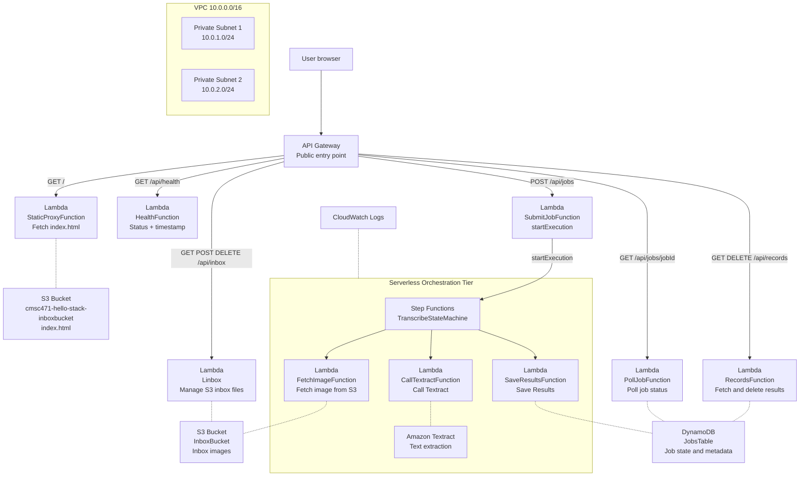

# CSMC 471 — 4-Tier Serverless Image Transcription Platform

Final project for CSMC 471. Implements a 4-tier serverless architecture on AWS using SAM/CloudFormation for Infrastructure as Code.

## Architecture Diagram



## API Endpoints

| Method | Path | Description |
|--------|------|-------------|
| GET | `/` | Returns index.html from S3 |
| GET | `/api/health` | Health check with date/time |
| GET | `/api/inbox` | List files in inbox bucket |
| POST | `/api/inbox?key=filename` | Upload image to inbox |
| DELETE | `/api/inbox/{key}` | Delete file from inbox |
| POST | `/api/jobs` | Submit transcription job |
| GET | `/api/jobs/{jobId}` | Poll job status |
| GET | `/api/records` | List completed transcription results |
| DELETE | `/api/records/{id}` | Delete a transcription record |

## Project Structure

```
csmc-471vpc/
├── template.yaml              # SAM/CloudFormation IaC
├── samconfig.toml             # SAM deployment config
├── statemachine/
│   └── transcribe.asl.json   # Step Functions state machine definition
├── health_service/            # Health check Lambda
├── src/
│   ├── proxy/                 # Static site proxy Lambda
│   ├── inbox/                 # Inbox management Lambda
│   ├── submit_job/            # Job submission Lambda
│   ├── poll_job/              # Job polling Lambda
│   ├── fetch_image/           # Step Functions: fetch image
│   ├── call_textract/         # Step Functions: call Textract
│   ├── save_results/          # Step Functions: save results
│   └── records/               # Records management Lambda
├── wwwroot/
│   └── index.html             # Frontend UI
└── tests/
    └── Acceptance/
        └── Features/          # Gherkin BDD feature files
```

## Deploy

```bash
sam build
sam deploy
```

## Upload Frontend

```bash
aws s3 cp ./wwwroot/index.html s3://cmsc471-hello-stack-inboxbucket/index.html
```

## Delete Stack

```bash
aws cloudformation delete-stack --stack-name cmsc471-hello-stack
```

## Architecture Notes

- **Aurora Serverless** is not available in AWS Learner Lab. DynamoDB is used as a substitute for relational metadata storage. In production, Aurora would be used.
- **Bedrock** is not available in AWS Learner Lab. Amazon Textract is used as a substitute for AI text extraction.
- **CloudFront** is not available in AWS Learner Lab (AccessDenied on cloudfront:ListDistributions). In production, CloudFront would distribute the static frontend globally with edge caching.
- **Route 53** is not available in AWS Learner Lab (no hosted zones permitted). In production, Route 53 would handle DNS routing to CloudFront.
- **ALB + Auto Scaling Group** replaced by API Gateway + Lambda serverless compute, which provides equivalent auto-scaling without managing EC2 instances.

## Well-Architected Review

| Pillar | Implementation |
|--------|---------------|
| Operational Excellence | CloudWatch logs on all Lambdas, X-Ray tracing enabled |
| Security | Private subnets, S3 bucket policies, encryption at rest (AES256/KMS), HTTPS enforced |
| Reliability | Step Functions retry logic, DynamoDB on-demand billing |
| Performance Efficiency | Lambda serverless compute, API Gateway regional endpoint |
| Cost Optimization | Serverless pay-per-use, DynamoDB PAY_PER_REQUEST, Lambda auto-scaling |
