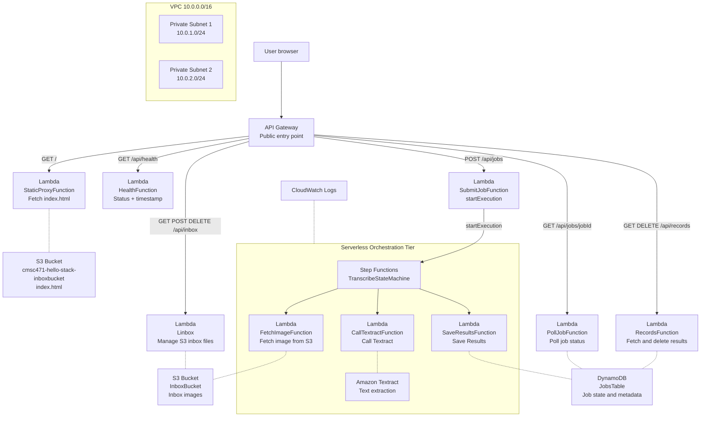

# CSMC 471 — 4-Tier Serverless Image Transcription Platform

Final project for CSMC 471. Implements a 4-tier serverless architecture on AWS using SAM/CloudFormation for Infrastructure as Code.

## Architecture Diagram



## API Endpoints

| Method | Path | Description |
|--------|------|-------------|
| GET | `/` | Returns index.html from S3 |
| GET | `/api/health` | Health check with date/time |
| GET | `/api/inbox` | List files in inbox bucket |
| POST | `/api/inbox?key=filename` | Upload image to inbox |
| DELETE | `/api/inbox/{key}` | Delete file from inbox |
| POST | `/api/jobs` | Submit transcription job |
| GET | `/api/jobs/{jobId}` | Poll job status |
| GET | `/api/records` | List completed transcription results |
| DELETE | `/api/records/{id}` | Delete a transcription record |

## Project Structure

```
csmc-471vpc/
├── template.yaml              # SAM/CloudFormation IaC
├── samconfig.toml             # SAM deployment config
├── statemachine/
│   └── transcribe.asl.json   # Step Functions state machine definition
├── health_service/            # Health check Lambda
├── src/
│   ├── proxy/                 # Static site proxy Lambda
│   ├── inbox/                 # Inbox management Lambda
│   ├── submit_job/            # Job submission Lambda
│   ├── poll_job/              # Job polling Lambda
│   ├── fetch_image/           # Step Functions: fetch image
│   ├── call_textract/         # Step Functions: call Textract
│   ├── save_results/          # Step Functions: save results
│   └── records/               # Records management Lambda
├── wwwroot/
│   └── index.html             # Frontend UI
└── tests/
    └── Acceptance/
        └── Features/          # Gherkin BDD feature files
```

## Deploy

```bash
sam build
sam deploy
```

## Upload Frontend

```bash
aws s3 cp ./wwwroot/index.html s3://cmsc471-hello-stack-inboxbucket/index.html
```

## Delete Stack

```bash
aws cloudformation delete-stack --stack-name cmsc471-hello-stack
```

## Architecture Notes

- **Aurora Serverless** is not available in AWS Learner Lab. DynamoDB is used as a substitute for relational metadata storage. In production, Aurora would be used.
- **Bedrock** is not available in AWS Learner Lab. Amazon Textract is used as a substitute for AI text extraction.
- **CloudFront** is not available in AWS Learner Lab (AccessDenied on cloudfront:ListDistributions). In production, CloudFront would distribute the static frontend globally with edge caching.
- **Route 53** is not available in AWS Learner Lab (no hosted zones permitted). In production, Route 53 would handle DNS routing to CloudFront.
- **ALB + Auto Scaling Group** replaced by API Gateway + Lambda serverless compute, which provides equivalent auto-scaling without managing EC2 instances.
- **Trusted Advisor** is not available in AWS Learner Lab (AccessDenied on trustedadvisor:DescribeAccount). In production, Trusted Advisor would provide recommendations for cost optimization, security, fault tolerance, and performance.

## Well-Architected Review

| Pillar | Implementation |
|--------|---------------|
| Operational Excellence | CloudWatch logs on all Lambdas, X-Ray tracing enabled |
| Security | Private subnets, S3 bucket policies, encryption at rest (AES256/KMS), HTTPS enforced |
| Reliability | Step Functions retry logic, DynamoDB on-demand billing |
| Performance Efficiency | Lambda serverless compute, API Gateway regional endpoint |
| Cost Optimization | Serverless pay-per-use, DynamoDB PAY_PER_REQUEST, Lambda auto-scaling |

### Well-Architected Questions and Answers

**Q1 (Operational Excellence): How do you monitor and respond to operational events?**
All Lambda functions have CloudWatch Log Groups with 7-day retention. X-Ray active tracing is enabled on every Lambda and API Gateway stage, providing end-to-end request tracing. CloudWatch captures all Step Functions state transitions, allowing us to identify failures at each workflow step (FetchImage, CallTextract, SaveResults).

**Q2 (Security): How do you protect data at rest and in transit?**
All S3 buckets use AES-256 server-side encryption. The InboxBucket uses KMS encryption with a bucket policy that explicitly denies all HTTP (non-HTTPS) requests via the `aws:SecureTransport` condition. DynamoDB data is encrypted at rest by default. In production, least-privilege IAM roles would be created per Lambda function. The Learner Lab restricts IAM policy creation so LabRole is used as a substitute.

**Q3 (Reliability): How do you handle failures in the transcription workflow?**
The Step Functions state machine implements retry logic on all three states (FetchImage, CallTextract, SaveResults) with exponential backoff — starting at 2 seconds, up to 3 attempts, with a backoff rate of 2. Each state also has a Catch block that routes failures to SaveResults, which marks the job as FAILED in DynamoDB so the UI can display the error to the user.

**Q4 (Performance Efficiency): How does the architecture scale under increased load?**
All compute is serverless Lambda, which scales automatically from 0 to thousands of concurrent executions without any manual intervention. API Gateway handles request routing and throttling. DynamoDB uses PAY_PER_REQUEST billing mode which scales read/write capacity automatically. Step Functions can run thousands of parallel executions simultaneously.

**Q5 (Cost Optimization): How do you minimize costs while maintaining functionality?**
The entire stack uses serverless pay-per-use pricing — there are no idle EC2 instances or reserved capacity costs. DynamoDB uses on-demand billing. Lambda charges only for actual execution time. The InboxBucket has a Glacier lifecycle policy that transitions images to cheaper cold storage after 90 days. The estimated monthly cost is $25.59 for 1 million requests, scaling to $0 when idle.

## Security and Compliance

### Secure Resource Lock-down
All S3 buckets block public access via `PublicAccessBlockConfiguration`. The InboxBucket enforces HTTPS-only access through a bucket policy denying requests where `aws:SecureTransport` is false. API Gateway uses HTTPS endpoints only. All Lambda functions run under the LabRole IAM role. In production, each Lambda would have its own least-privilege role with only the specific permissions it needs (e.g., FetchImageFunction would only have `s3:GetObject` on InboxBucket).

### Data Protection
- S3 buckets: AES-256 server-side encryption at rest
- InboxBucket: KMS encryption with `alias/aws/s3`
- DynamoDB: encrypted at rest by default
- All API traffic: HTTPS enforced via API Gateway
- S3 versioning enabled on MyBucket for data recovery

### Access Limitations
- API Gateway endpoints are public but unauthenticated (acceptable for a demo app)
- In production, AWS Cognito or IAM authorizers would restrict access to known clients
- Step Functions can only be triggered by SubmitJobFunction via the state machine ARN
- Lambda functions cannot be invoked directly from the internet

### Disaster Recovery
- S3 versioning is enabled on MyBucket, allowing recovery of previous versions of index.html
- DynamoDB on-demand mode provides built-in high availability across multiple AZs
- Step Functions retry logic prevents transient failures from causing data loss
- In production, DynamoDB Point-in-Time Recovery (PITR) would be enabled for full backup capability
- S3 Glacier lifecycle policy archives inbox images after 90 days for long-term compliance

## Total Cost of Ownership (TCO)

AWS Pricing Calculator estimate: https://calculator.aws/#/estimate?id=e1dbd6f0ff4b6966d9f8077a6afc6a606bd03752

| Service | Monthly Cost |
|---------|-------------|
| AWS Lambda | $17.81 |
| Amazon API Gateway | $3.50 |
| Amazon S3 | $0.32 |
| Amazon DynamoDB | $0.06 |
| AWS Step Functions | $2.40 |
| Amazon Textract | $1.50 |
| **Total** | **$25.59/month** |

Annual estimate: **$307.08/year** with $0 upfront cost. Serverless pay-per-use model means costs scale directly with usage.
